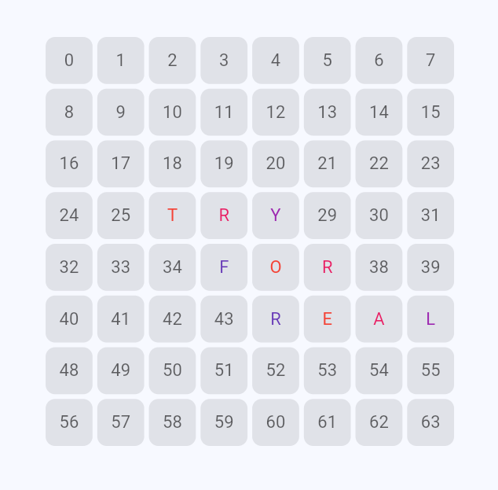

# 🇼ord Matching Game

Practice words with friends. Unleash your dictionary skills 🤓

## Rules

The rules are extremley simple. You got an N by N square board.

- Make words by placing alphabets in order
- Whoever places the last letter that makes a whole word get's point
- The larger the word is, the more points you receive
- Play until the board fills up, or for as long as you want 😉
- Maybe savatoge others attempts of making a bigass word

### Start playing at [words.fr.to](https://words.fr.to)

## Credits

**Words List:** [John Lawler @ umich](https://websites.umich.edu/~jlawler/wordlist.html)\
**Domain From:** [afraid.org](https://freedns.afraid.org/)\
**Hosted On:** [GitHub Pages](https://pages.github.com)\
**Deleloped With:** [SkelteKit](https://svelte.dev)\
**Author:** Yours truley
